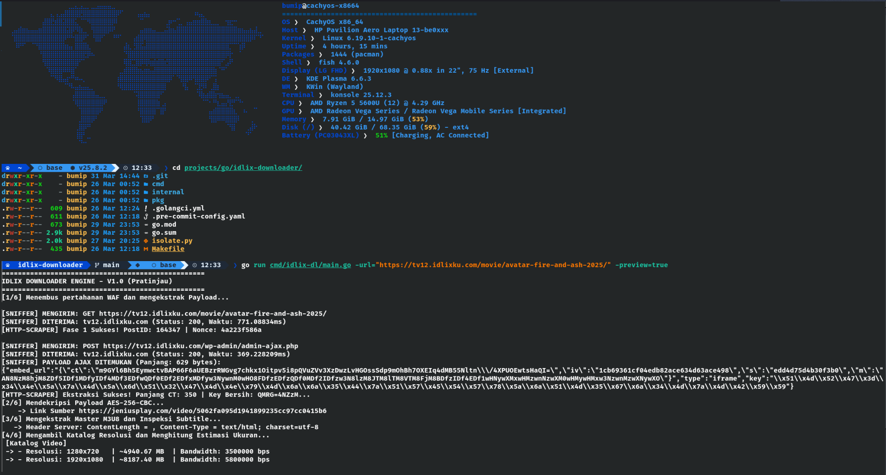
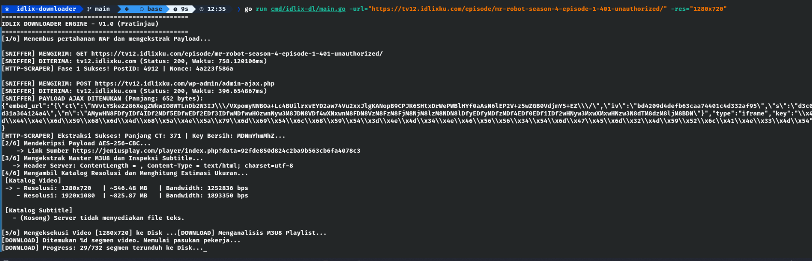
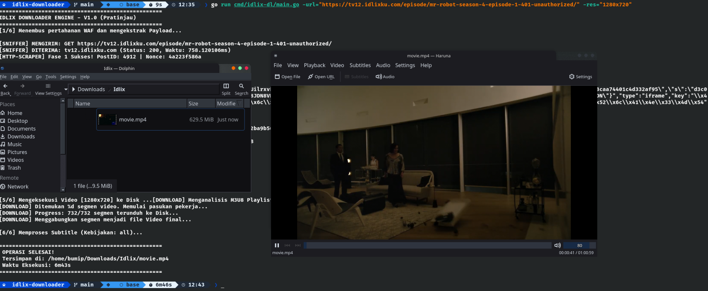

# Idlix Downloader Engine (idlix-dl)


**Idlix Downloader Engine** adalah antarmuka baris perintah (CLI) berkinerja tinggi yang ditulis dalam Golang untuk mengekstrak dan mengunduh aliran video HLS (M3U8) dan *subtitle* dari platform agregator. Proyek ini dibangun sebagai eksperimen rekayasa perangkat lunak untuk mendemonstrasikan teknik *Web Scraping*, dekripsi AES-256-CBC, manipulasi DOM/JSON parsial, dan konkurensi (Goroutines).

---

## Disclaimer
**Proyek ini dibuat MURNI untuk tujuan edukasi dan penelitian keamanan jaringan.** Pengembang tidak mendorong, memfasilitasi, atau membenarkan pembajakan hak cipta. Pengguna bertanggung jawab penuh atas tindakan mereka sendiri saat menggunakan perangkat lunak ini. Perangkat lunak ini tidak berafiliasi dengan, dikelola oleh, atau didukung oleh situs agregator mana pun.

## Fitur Utama

* **Konkurensi Ekstrem:** Menggunakan *worker pool* Goroutines untuk mengunduh ribuan segmen `.ts` secara paralel, memaksimalkan *bandwidth* jaringan Anda.
* **WAF Bypass & Decryption:** Secara otomatis merakit *HTTP Headers* untuk melewati *Web Application Firewall* dan mendekripsi *payload* AES-256-CBC murni di memori.
* **Pratinjau Terpusat (Preview Mode):** Menghitung estimasi ukuran file (MB/KB) dan menampilkan katalog resolusi serta *subtitle* tanpa mengeksekusi I/O ke *disk*.
* **Ekstraksi Subtitle Cerdas:** Mendukung pengambilan *subtitle* gabungan dari DOM HTML dan JSON API, lengkap dengan sistem pencarian alternatif (*Fallback Engine*) otomatis jika peladen utama kosong.
* **A La Carte Selection:** Kontrol penuh atas resolusi video mana yang ingin diunduh dan bahasa *subtitle* spesifik yang ingin disimpan (*Sidecar Subtitles*).

---
## Tangkapan Layar (Screenshots)

**1. Tampilan Mode Pratinjau (Preview Mode)**
Menampilkan katalog resolusi video dan subtitle sebelum mengunduh.


**2. Tampilan Eksekusi Pengunduhan**
Menampilkan indikator kecepatan I/O dan persentase unduhan.


**3. Tampilan Hasil Pengunduhan**
Menampilkan lokasi penyimpanan dan pemutaran film.


---

## Prasyarat

* [Go](https://golang.org/dl/) versi 1.21 atau yang lebih baru.
* Sistem operasi berbasis Unix (Linux/macOS) direkomendasikan, meskipun kompatibel dengan Windows.

## Instalasi

Kloning repositori ini dan kompilasi *binary*-nya:

```bash
git clone [https://github.com/imamputra1/idlix-downloader.git](https://github.com/imamputra1/idlix-downloader.git)
cd idlix-downloader
go build -o idlix-dl cmd/idlix-dl/main.go

# (Opsional) Pindahkan ke bin directory agar dapat dipanggil dari mana saja
sudo mv idlix-dl /usr/local/bin/
```

## Panduan Penggunaan
---
Aplikasi ini menggunakan sistem bendera (flags) untuk kustomisasi. Parameter `-url=` wajib diisi.
Mode Pratinjau (Inspeksi Metadata Tanpa Mengunduh)

* Gunakan ini untuk mengecek resolusi, ketersediaan subtitle, dan estimasi ukuran file.
```bash
idlix-dl -url="https://tv12.../movie-path/" -preview=true
```
* Mode Autopilot (Kualitas Terbaik & Semua Subtitle)
Sistem akan otomatis memilih resolusi best dan mengunduh semua bahasa subtitle yang tersedia ke direktori ~/Downloads/Idlix.
```bash
idlix-dl -url="https://tv12.../movie-path/"
```
* Mode Kustom Presisi (Resolusi & Subtitle Spesifik)
Contoh: Mengunduh versi 720p, hanya subtitle Indonesia, menggunakan 25 pekerja paralel, dan menentukan direktori serta nama file secara manual.
```bash
idlix-dl -url="https://tv12.../movie-path/" \
  -res="1280x720" \
  -sub="Indonesia" \
  -workers=25 \
  -dir="/mnt/media/movies" \
  -name="Judul_Film_Tahun.mp4"
```
## Daftar Referensi Parameter (Flags)

| Flag | Tipe | Bawaan (Default) | Deskripsi |
|------|------|------------------|-----------|
| `-url` | `string` | *(Wajib)* | URL target dari episode/film yang ingin diunduh. |
| `-dir` | `string` | `~/Downloads/Idlix` | Direktori absolut tempat file akan disimpan. |
| `-name` | `string` | `movie.mp4` | Nama file keluaran (termasuk ekstensi `.mp4`). |
| `-res` | `string` | `best` | Resolusi target (contoh: `1920x1080`, `1280x720`, atau `best`). |
| `-sub` | `string` | `all` | Filter Subtitle: `all` (unduh semua), `none` (abaikan), atau label spesifik (misal: `Indonesia`). |
| `-workers` | `int` | `15` | Jumlah *Goroutine* paralel untuk mengunduh segmen. |
| `-preview` | `bool` | `false` | Hanya mengekstrak metadata tanpa menyimpan file ke *hard disk*. |


---

### 2. `LICENSE` (Perlindungan Hukum Anda)

```text
MIT License

Copyright (c) 2026 Agus Imam Syahputra

Permission is hereby granted, free of charge, to any person obtaining a copy
of this software and associated documentation files (the "Software"), to deal
in the Software without restriction, including without limitation the rights
to use, copy, modify, merge, publish, distribute, sublicense, and/or sell
copies of the Software, and to permit persons to whom the Software is
furnished to do so, subject to the following conditions:

The above copyright notice and this permission notice shall be included in all
copies or substantial portions of the Software.

THE SOFTWARE IS PROVIDED "AS IS", WITHOUT WARRANTY OF ANY KIND, EXPRESS OR
IMPLIED, INCLUDING BUT NOT LIMITED TO THE WARRANTIES OF MERCHANTABILITY,
FITNESS FOR A PARTICULAR PURPOSE AND NONINFRINGEMENT. IN NO EVENT SHALL THE
AUTHORS OR COPYRIGHT HOLDERS BE LIABLE FOR ANY CLAIM, DAMAGES OR OTHER
LIABILITY, WHETHER IN AN ACTION OF CONTRACT, TORT OR OTHERWISE, ARISING FROM,
OUT OF OR IN CONNECTION WITH THE SOFTWARE OR THE USE OR OTHER DEALINGS IN THE
SOFTWARE.
